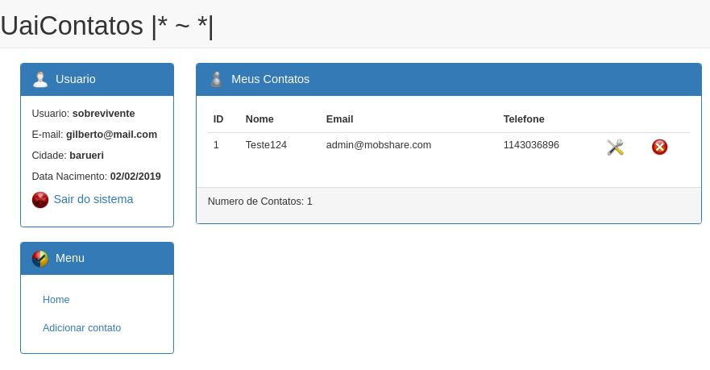

[](https://heroku.com/deploy/?template=https://github.com/gilberto-009199/JAgendaWeb)
[](https://gitpod.io#https://github.com/gilberto-009199/JAgendaWeb)
# Projeto Agenda Web com Java




 Agenda de contatos web feita com [JSP](https://www.javafree.org/artigo/868717/JSP-Java-Server-Pages.html),[Bootstrap](https://getbootstrap.com) e [Jquery](https://jquery.com).

## How Run:

 Utilize o maven para compilar o programa ao final ele vai gera um arquivo jar executavel
### docker:
```shell
$ docker compose up
```

### maven:
```shell
$ mvn install
$ mv banco.sqlite ./target/bin/
$ ./target/bin/webapp
```

## Bibliotecas

* [JSP](https://pt.wikipedia.org/wiki/JavaServer_Pages) - Plataforma para desenvolvimento web em java
* [Bootstrap](https://getbootstrap.com) - Biblioteca Front End para estilização
* [Jquery](https://jquery.com) - Biblioteca JS para agilizar a codificação no Front End
 
